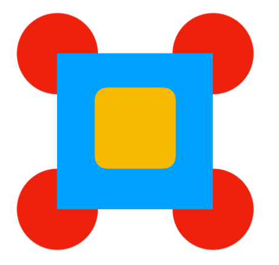

# Figure-Position

### Draw this figure

- [x] Properties `position` `z-index` `:hover`
- [x] Use color-picker
- [x] Each circle on hover changes color and becomes higher than the square
- [x] The large square changes color on hover and becomes taller than the small square.

## [Figure](https://zakharchuk-andrey.github.io/Figure-Position/)
